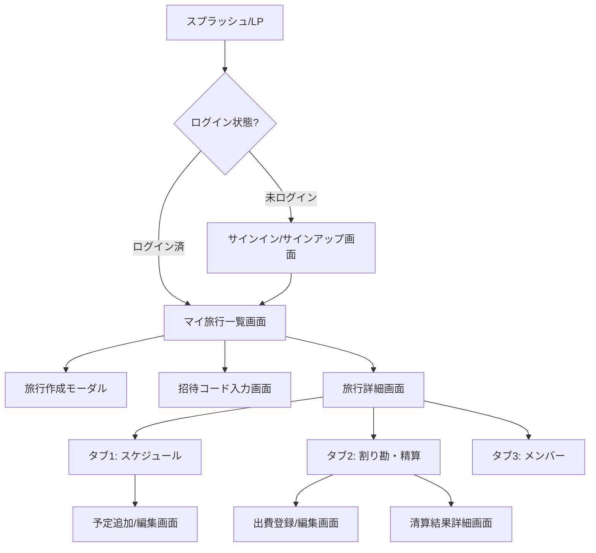

# 旅行計画・割り勘スマホアプリ「TripApp (仮称)」仕様書

本ドキュメントでは、旅行計画の共有およびWalica風の自動割り勘計算機能を備えたスマートフォン向けWebアプリケーションの要求整理、要件定義、および画面設計について定義します。

---

## 1. プロジェクト概要
旅行のスケジュール調整から、旅行中の共同編集、旅行後の面倒な割り勘精算までをワンストップで解決するスマートフォン向けWebアプリケーションです。

---

## 2. 要求整理 (ユーザー視点の課題と解決策)

### 2.1. 解決したい課題
1. **旅行計画が散らばる**: LINEのノートやスプレッドシートなど、別々のツールで行うと見づらく、直前の確認がしづらい。一目でスケジュールを把握したい。
2. **情報の非対称性**: 旅行の作成者だけが計画を把握しており、他のメンバーが詳細を知らない・編集しづらい。
3. **割り勘の計算が面倒**: 旅行中、誰がどのタイミングでいくら立て替えたかの管理が複雑。最後に「誰が誰にいくら払えば最も効率的（送金回数が最小）か」を計算するのが極めて面倒。

### 2.2. ユースケース
* **事前準備**: 
  1. ホストがアプリ上で「北海道旅行 3日間」のようなイベントを作成する。
  2. メンバーに招待コード/リンクをシェアする。
  3. メンバーがアカウントを作成し、招待コードを入力して旅行に参加する。
  4. メンバー全員でスケジュール（〇時に羽田空港、〇時にレンタカーなど）を共同編集し、タイムラインを作成する。
* **旅行中**:
  5. タイムラインを見ながら行動する。
  6. 食事代やレンタカー代が発生した際、立て替えた人が「支払人・金額・対象メンバー」を入力して記録する。
* **旅行後**:
  7. アプリが自動計算した「清算ルート（例：AさんがBさんに1,500円支払う）」を確認する。
  8. 各自が送金を完了させ、清算をクローズする。

---

## 3. 要件定義

### 3.1. 機能要件

#### ① ユーザー管理機能
* **新規登録 / ログイン**: メールアドレスとパスワードによる認証。
* **プロフィール設定**: アプリ内で表示される表示名（ニックネーム）の設定。

#### ② 旅行グループ管理機能
* **旅行の新規作成**: タイトル、開始日、終了日、カバー画像の設定。
* **メンバー招待機能**: ユニークな「招待コード」を発行。
* **旅行への参加**: 招待コードを入力してグループに加入。
* **メンバー一覧表示**: 参加しているユーザーの確認。

#### ③ 旅行計画（スケジュール）共同編集機能
* **タイムライン表示**: 日付ごとに時系列で予定を表示。
* **予定の追加・編集・削除**: 
  * 項目名（例：「昼食」「ホテルチェックイン」）
  * 開始時間・終了時間
  * 場所・メモ（マップのURLなど）
* **リアルタイム同期**: 誰かが更新した内容が即座に他のメンバーにも反映される仕組み（WebSocket or 定期ポーリング）。

#### ④ 割り勘（経費精算）機能
* **出費の記録**:
  * 支払った人（誰が）
  * 金額（いくら）
  * 内容（何に：例「レンタカー代」）
  * 対象者（誰のために：全員、もしくは一部のメンバーを選択）
* **出費履歴の一覧表示・編集・削除**: これまでに記録された出費の一覧。
* **自動精算計算 (Walica風)**:
  * 登録された出費データを元に、各メンバーの「純貸借 (Net Balance)」を算出。
  * **「誰が誰にいくら払えばよいか」の送金回数を最小化する清算ルート**を自動計算して提示。

---

## 4. 画面設計

スマートフォンでの操作に最適化した 1 カラム構成の UI を想定します。

### 4.1. 画面遷移図 (Mermaid)

### 4.2. 各画面の構成要素

#### ① サインイン/サインアップ画面
* メールアドレス入力欄
* パスワード入力欄
* 「ログイン」ボタン / 「新規登録」ボタン

#### ② マイ旅行一覧画面 (ダッシュボード)
* ヘッダー: プロフィールアイコン、ログアウトボタン
* 旅行リスト: 作成済・参加済の旅行カード（タイトル、日程、メンバー数）
* フッターアクション:
  * 「＋ 旅行を作成する」ボタン
  * 「招待コードで参加」ボタン

#### ③ 旅行詳細画面 (共通)
* ヘッダー: 旅行タイトル、日程、戻るボタン
* メインタブナビゲーション (画面上部または下部):
  * 「スケジュール」
  * 「割り勘」
  * 「メンバー」

##### ③-A. 「スケジュール」タブ
* 日付セレクター (1日目, 2日目, 3日目...)
* タイムラインビュー:
  * 時系列に並んだカード（時間、予定名、場所、メモ）
* 右下フローティングアクションボタン (FAB): 「＋ 予定を追加」

##### ③-B. 「割り勘」タブ
* 概要カード:
  * 旅行の総出費額
  * 自分の現在の収支（「＋〇〇円もらえる」または「ー〇〇円支払う」）
* アクションエリア:
  * 「＋ 出費を記録する」ボタン
  * 「清算結果を見る」ボタン
* 出費履歴リスト:
  * 日付、内容、支払者、金額、割り勘対象メンバー

##### ③-C. 「メンバー」タブ
* 招待セクション:
  * 招待コード（タップでコピー）
  * 招待用URL（タップでコピー）
* メンバーリスト:
  * メンバーの表示名、ホストバッジ

---

## 5. 割り勘自動精算のアルゴリズム設計

Walicaのように「送金回数を最小限にする」ためのロジックを以下のように設計します。

### 5.1. 基本概念
* **メンバーの支払額 ($P_i$)**: メンバー $i$ が実際に支払った合計金額。
* **メンバーの負担額 ($U_i$)**: メンバー $i$ が支払うべき（消費した）合計金額。
  * 例：12,000円のレンタカー代をAが支払い、対象者が A, B, C の3人なら、各自の負担額は $12,000 \div 3 = 4,000$ 円。
* **純貸借 ($B_i$)**: $B_i = P_i - U_i$
  * $B_i > 0$ の場合: お金が戻ってくるべき人（債権者 / Creditor）
  * $B_i < 0$ の場合: お金を支払うべき人（債務者 / Debtor）
  * $B_i = 0$ の場合: 清算不要

### 5.2. 清算ルート算出ロジック (Greedy法)
1. 全メンバーの $B_i$ を計算する。
2. メンバーを2つのグループに分ける。
   * **Debtors**: $B_i < 0$ のメンバー（絶対値の降順でソート）
   * **Creditors**: $B_i > 0$ のメンバー（値の降順でソート）
3. Debtorsの先頭（最も支払うべき額が多い人 $D$）と、Creditors of the top（最も受け取るべき額が多い人 $C$）を取り出す。
4. 送金金額 $A = \min(|B_D|, B_C)$ を決定する。
5. 「$D$ から $C$ へ $A$ 円送金する」という清算ルートを記録する。
6. $B_D$ と $B_C$ を更新する:
   * $B_D \leftarrow B_D + A$
   * $B_C \leftarrow B_C - A$
7. 更新後の値が 0 でないメンバーは、再度それぞれのグループの適切な位置に戻す。
8. 全員の $B_i$ が 0 になる（または誤差範囲内になる）までステップ3〜7を繰り返す。

このアルゴリズムにより、最も少ない送金回数で公平な清算が可能になります。
