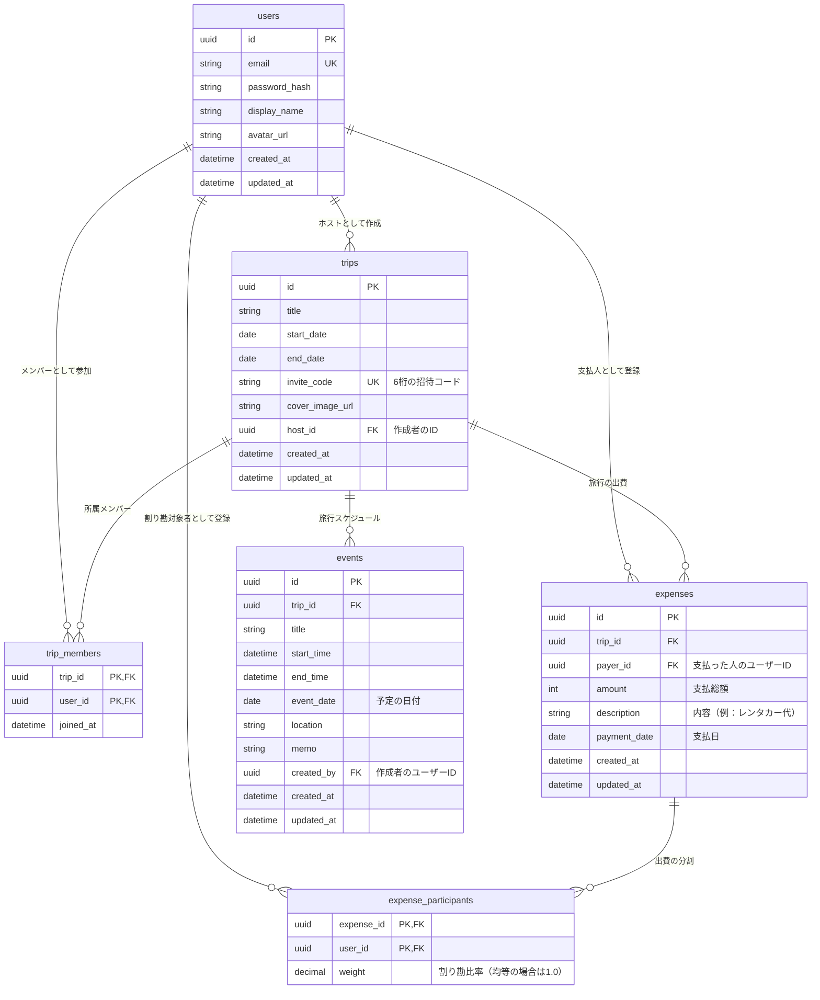

# データモデル設計

本ドキュメントでは、旅行計画・割り勘スマホアプリ「TripApp (仮称)」に必要なデータベースの設計およびデータ構造について定義します。

---

## 1. ER図 (Entity Relationship Diagram)

データベースのテーブル構造と、それぞれの関係性を以下に示します。

---

## 2. テーブル定義詳細

### 2.1. users (ユーザー情報テーブル)
ユーザーのアカウントおよびプロフィール情報を管理します。

| カラム名 | 物理名 | データ型 | 制約 | 説明 |
| :--- | :--- | :--- | :--- | :--- |
| ユーザーID | `id` | UUID | PRIMARY KEY, DEFAULT gen_random_uuid() | ユーザーの一意識別子 |
| メールアドレス | `email` | VARCHAR(255) | UNIQUE, NOT NULL | ログイン用メールアドレス |
| パスワードハッシュ | `password_hash` | VARCHAR(255) | NOT NULL | セキュリティ保護されたパスワード |
| 表示名 | `display_name` | VARCHAR(50) | NOT NULL | アプリ内で表示されるニックネーム |
| アバター画像URL | `avatar_url` | TEXT | NULLABLE | プロフィール画像の保存先URL |
| 作成日時 | `created_at` | TIMESTAMP | NOT NULL, DEFAULT NOW() | アカウント作成日時 |
| 更新日時 | `updated_at` | TIMESTAMP | NOT NULL, DEFAULT NOW() | アカウント情報更新日時 |

### 2.2. trips (旅行情報テーブル)
旅行グループの器となる情報を管理します。

| カラム名 | 物理名 | データ型 | 制約 | 説明 |
| :--- | :--- | :--- | :--- | :--- |
| 旅行ID | `id` | UUID | PRIMARY KEY, DEFAULT gen_random_uuid() | 旅行の一意識別子 |
| 旅行タイトル | `title` | VARCHAR(100) | NOT NULL | 旅行のタイトル（例：北海道旅行） |
| 開始日 | `start_date` | DATE | NOT NULL | 旅行の開始日 |
| 終了日 | `end_date` | DATE | NOT NULL | 旅行の終了日 |
| 招待コード | `invite_code` | VARCHAR(6) | UNIQUE, NOT NULL | 参加用コード（英数字6桁） |
| カバー画像URL | `cover_image_url` | TEXT | NULLABLE | 旅行の背景画像URL |
| ホストID | `host_id` | UUID | FOREIGN KEY (users.id) | 旅行作成者のユーザーID |
| 作成日時 | `created_at` | TIMESTAMP | NOT NULL, DEFAULT NOW() | 旅行作成日時 |
| 更新日時 | `updated_at` | TIMESTAMP | NOT NULL, DEFAULT NOW() | 旅行情報更新日時 |

### 2.3. trip_members (旅行メンバー中間テーブル)
どのユーザーがどの旅行グループに参加しているかを管理します（多対多の接続）。

| カラム名 | 物理名 | データ型 | 制約 | 説明 |
| :--- | :--- | :--- | :--- | :--- |
| 旅行ID | `trip_id` | UUID | PRIMARY KEY, FOREIGN KEY (trips.id) ON DELETE CASCADE | 参加対象の旅行ID |
| ユーザーID | `user_id` | UUID | PRIMARY KEY, FOREIGN KEY (users.id) ON DELETE CASCADE | 参加するユーザーID |
| 参加日時 | `joined_at` | TIMESTAMP | NOT NULL, DEFAULT NOW() | グループに参加した日時 |

### 2.4. events (予定/スケジュールテーブル)
旅行ごとのスケジュール情報を時系列で管理します。

| カラム名 | 物理名 | データ型 | 制約 | 説明 |
| :--- | :--- | :--- | :--- | :--- |
| 予定ID | `id` | UUID | PRIMARY KEY, DEFAULT gen_random_uuid() | 予定の一意識別子 |
| 旅行ID | `trip_id` | UUID | FOREIGN KEY (trips.id) ON DELETE CASCADE, NOT NULL | 紐づく旅行ID |
| 予定タイトル | `title` | VARCHAR(100) | NOT NULL | 予定の名前（例：ホテルチェックイン） |
| 開始時間 | `start_time` | TIME | NULLABLE | 予定の開始時間（HH:MM） |
| 終了時間 | `end_time` | TIME | NULLABLE | 予定の終了時間（HH:MM） |
| 予定日付 | `event_date` | DATE | NOT NULL | 予定が実施される日付 |
| 場所 | `location` | VARCHAR(255) | NULLABLE | 予定の場所（住所やマップのURLなど） |
| メモ | `memo` | TEXT | NULLABLE | 持ち物や補足事項など自由記述 |
| 作成者ID | `created_by` | UUID | FOREIGN KEY (users.id) ON DELETE SET NULL | 予定を登録したユーザーID |
| 作成日時 | `created_at` | TIMESTAMP | NOT NULL, DEFAULT NOW() | 予定作成日時 |
| 更新日時 | `updated_at` | TIMESTAMP | NOT NULL, DEFAULT NOW() | 予定更新日時 |

### 2.5. expenses (出費/経費テーブル)
旅行中に誰がいくら支払ったかの経費データを管理します。

| カラム名 | 物理名 | データ型 |制約 | 説明 |
| :--- | :--- | :--- | :--- | :--- |
| 出費ID | `id` | UUID | PRIMARY KEY, DEFAULT gen_random_uuid() | 出費の一意識別子 |
| 旅行ID | `trip_id` | UUID | FOREIGN KEY (trips.id) ON DELETE CASCADE, NOT NULL | 紐づく旅行ID |
| 支払者ID | `payer_id` | UUID | FOREIGN KEY (users.id) ON DELETE RESTRICT, NOT NULL | 実際に立て替えて支払ったユーザーID |
| 支払総額 | `amount` | INT | NOT NULL | 支払った総額（日本円を想定） |
| 出費内容 | `description` | VARCHAR(100) | NOT NULL | 出費の項目（例：レンタカー代、お土産） |
| 支払日 | `payment_date` | DATE | NOT NULL | 支払が発生した日 |
| 作成日時 | `created_at` | TIMESTAMP | NOT NULL, DEFAULT NOW() | 出費の登録日時 |
| 更新日時 | `updated_at` | TIMESTAMP | NOT NULL, DEFAULT NOW() | 出費の更新日時 |

### 2.6. expense_participants (出費対象メンバー中間テーブル)
各出費において、誰が割り勘の対象者（負担者）になるかを管理します（多対多の接続）。

| カラム名 | 物理名 | データ型 | 制約 | 説明 |
| :--- | :--- | :--- | :--- | :--- |
| 出費ID | `expense_id` | UUID | PRIMARY KEY, FOREIGN KEY (expenses.id) ON DELETE CASCADE | 対象の出費ID |
| ユーザーID | `user_id` | UUID | PRIMARY KEY, FOREIGN KEY (users.id) ON DELETE CASCADE | 負担するメンバーのユーザーID |
| 負担比率（重み） | `weight` | DECIMAL(3, 2) | NOT NULL, DEFAULT 1.0 | 割り勘の比率。全員均等の場合は 1.0。例：2倍払う場合は 2.0、半額なら 0.5。 |

---

## 3. データ整合性・セキュリティルール

1. **カスケード削除の防止 (RESTRICT)**
   - 出費データ (`expenses`) に紐づいているユーザー (`users`) が削除される際、履歴の不整合を防ぐため、`payer_id` に紐づくユーザーはそのまま物理削除せず、論理削除（退会済み表示）にするか、または `ON DELETE RESTRICT` で削除を制限します。
2. **自動計算への影響**
   - 出費が登録または削除された場合、メンバーの「純貸借」はリアルタイムで再計算されるロジック（ビューの作成、またはアプリケーション層での動的クエリ）を構築します。
3. **招待コードの重複回避**
   - `invite_code` はアプリ全体で一意（UNIQUE）とし、旅行作成時にランダムな文字列を生成した際、重複があれば再生成を行うロジックを実装します。
