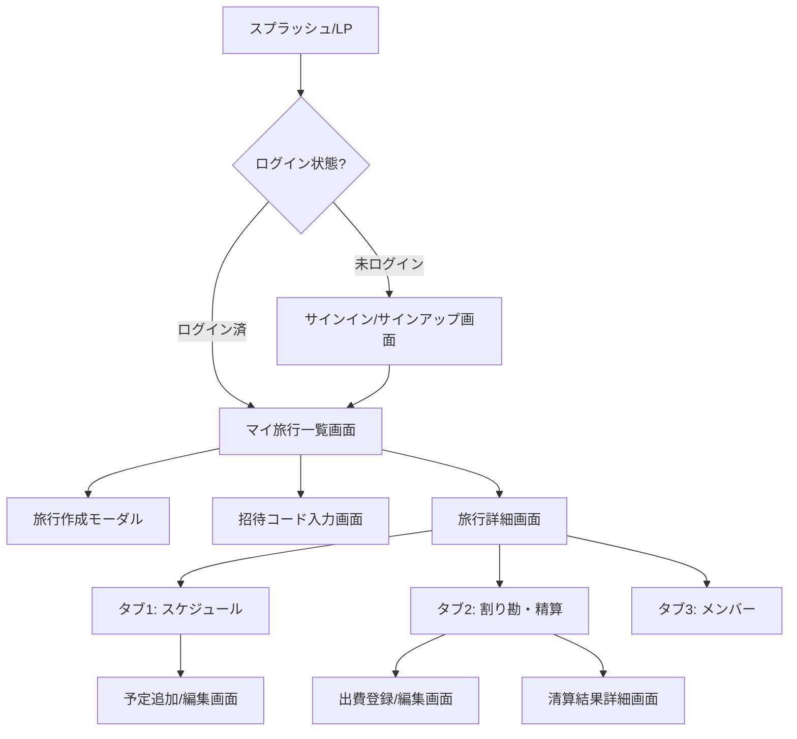

# 画面設計

本ドキュメントでは、旅行計画・割り勘スマホアプリ「TripApp (仮称)」の画面遷移および各画面の構成について定義します。

---

## 1. 画面遷移図

---

## 2. 各画面の構成要素

### 2.1. サインイン/サインアップ画面
* **用途**: ユーザー認証およびアカウント作成
* **構成要素**:
  * アプリロゴ
  * メールアドレス入力フォーム
  * パスワード入力フォーム
  * ログインボタン
  * アカウント新規登録リンク / 登録ボタン

### 2.2. マイ旅行一覧画面 (ダッシュボード)
* **用途**: 自分が関わっている旅行の一覧表示と、新しい旅行へのアクセス
* **構成要素**:
  * ヘッダー: アプリタイトル、プロフィール設定へのリンク、ログアウトボタン
  * 旅行一覧リスト:
    * 自分が作成した旅行、または招待されて参加している旅行をカード形式で表示（タイトル、日程、参加メンバーのアイコン/人数）
  * アクションエリア:
    * 「＋ 新しい旅行を作成」ボタン
    * 「招待コードで旅行に参加」ボタン

### 2.3. 旅行詳細画面 (共通UI)
* **用途**: 選択した旅行のメイン操作画面（画面下部または上部のタブで切り替え）
* **共通ヘッダー**:
  * 戻るボタン（旅行一覧へ戻る）
  * 旅行タイトル
  * 日程 (例: 2026/08/10 ~ 2026/08/12)
* **タブナビゲーション**:
  * 「スケジュール」タブ
  * 「割り勘」タブ
  * 「メンバー」タブ

---

## 3. タブ内画面の構成要素

### 3.1. 「スケジュール」タブ
* **用途**: 旅行日程のタイムライン表示と予定の共同編集
* **構成要素**:
  * **日付セレクター**: 1日目、2日目、3日目... といった日程切り替えタブ
  * **タイムラインリスト**:
    * 時系列順に予定カードを配置（時間、予定名、場所、メモ/リンク）
  * **フローティングアクションボタン (FAB)**:
    * 「＋ 予定を追加」（タップで予定入力フォームへ遷移またはモーダル表示）
  * **予定追加/編集フォーム**:
    * 予定名、開始時間、終了時間、場所、メモ（URL等）

### 3.2. 「割り勘」タブ
* **用途**: 旅行中の出費の記録と、自動計算された清算ルートの確認
* **構成要素**:
  * **サマリーカード**:
    * 旅行の総出費金額
    * 自分の現在の収支（例：「あなたには現在 ＋2,500円 戻ってきます」または「あなたは現在 ⑤3,000円 支払う必要があります」）
  * **アクションエリア**:
    * 「＋ 出費を記録する」ボタン
    * 「清算結果（誰が誰に支払うか）を見る」ボタン
  * **出費履歴リスト**:
    * 支払日、出費内容、支払者（誰が）、金額、割り勘対象メンバー（全員、または一部の顔アイコン）
  * **出費登録/編集フォーム**:
    * 内容（例：「レンタカー代」）、金額、支払日、支払者（デフォルトは自分）、対象メンバー（チェックボックスで選択）

### 3.3. 「メンバー」タブ
* **用途**: 参加メンバーの確認と、新規メンバーの招待
* **構成要素**:
  * **招待コードセクション**:
    * 招待コード（例: `A8F9K2`）と「コピー」ボタン
    * 招待用リンクと「コピー」ボタン
  * **メンバーリスト**:
    * 参加している全メンバーのアイコンと表示名
    * 「ホスト（作成者）」などのバッジ表示
